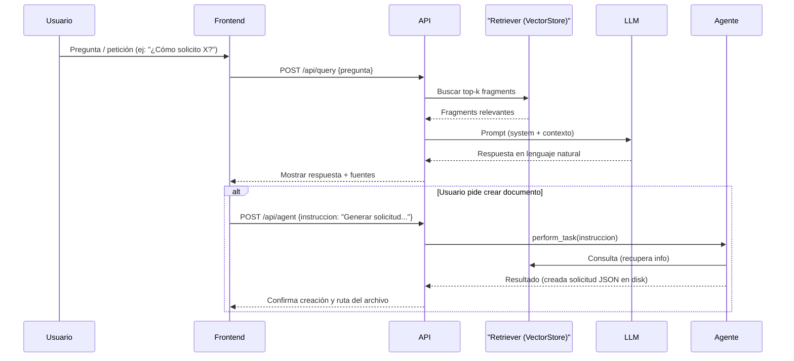

# DOCUMENTACIÓN DEL PROYECTO — Asistente RAG para TEA Andalucía

**Fecha:** 2025-12-04

## **Introducción**
- **Proyecto:** Asistente conversacional orientado a resolver dudas y asistir en tareas administrativas para familias con miembros con autismo en Andalucía.
- **Objetivo:** Diseñar e implementar un chatbot que combine recuperación de información (RAG) y capacidades de agente autónomo (ejecutar acciones como generar solicitudes), usando componentes reproducibles y explicando el uso del Procesamiento del Lenguaje Natural (PLN).

## **Instalación y ejecución (entorno Windows / PowerShell)**
- Requisitos previos:
  - Python 3.10+ instalado
  - Git (opcional, para subir al repositorio)
- Pasos rápidos para clonar, instalar dependencias y ejecutar localmente:

```powershell
cd C:\Users\juanm\Documents\BigData\rag_Proyecto\rag_teandalucia
$env:PYTHONPATH = $PWD
python -m pip install -r requirements.txt
# Generar índice (si tienes PDFs en data/)
python -m uvicorn main:app --host 127.0.0.1 --port 9000
```

- Pruebas sin servidor (útil para depuración):
```powershell
$env:PYTHONPATH = $PWD
python scripts/test_agent.py
```

- Petición de ejemplo a la API (`/api/agent`):
```powershell
curl -X POST "http://127.0.0.1:9000/api/agent" -H "Content-Type: application/json" -d '{ "instruccion": "Generar solicitud de reconocimiento de discapacidad", "usuario_id": "usuario_juan" }'
```

## **Estructura de archivos principal (resumen)**
- `main.py` — API FastAPI que expone endpoints `/api/query`, `/api/reindex`, `/api/agent`, `/api/historial`.
- `services/`:
  - `rag_service.py` — implementación RAG (carga embeddings, búsqueda por similitud y generación con Gemini).
  - `embeddings.py` — generación y guardado de embeddings con `sentence-transformers`.
  - `chunking.py` — fragmentación (chunking) de textos limpios.
  - `process_pdfs.py` — extracción y limpieza de texto desde PDFs.
  - `agent_service.py` — `SimpleAgent` (agente sencillo que puede crear solicitudes JSON en `data/solicitudes/`).
- `static/` — frontend estático (HTML/CSS/JS) con una UI ligera que consume la API.
- `data/` — documentos y subcarpetas (`perfiles/`, `solicitudes/` etc.).
- `scripts/test_agent.py` — script para probar `SimpleAgent` sin levantar el servidor.

## **Qué uso hace el proyecto del Procesamiento del Lenguaje Natural (PLN) y por qué es útil**
- **Uso del PLN en el proyecto:**
  - Extracción de texto de PDFs y normalización (limpieza, tokenización implícita en los modelos de embeddings).
  - Generación de embeddings semánticos (`sentence-transformers`) para representar fragmentos de texto en un espacio vectorial.
  - Recuperación semántica (RAG): búsqueda de fragmentos relevantes por similitud de embeddings.
  - Generación de lenguaje natural (LLM — Google Gemini) para producir respuestas en lenguaje humano a partir del contexto recuperado.

- **Por qué es útil usar PLN aquí:**
  - Permite transformar documentos legales/administrativos en conocimiento consultable de forma semántica.
  - Mejora la precisión de las respuestas al basarlas en fragmentos concretos de documentos (reduciendo respuestas hallucinadas).
  - Facilita automatizar tareas administrativas de forma asistida (ej. generar borradores de solicitudes) con instrucciones naturales.
  - Mejora la accesibilidad: respuestas en lenguaje sencillo adaptadas para familias.

## **Diagrama conversacional (Mermaid)**
- El diagrama describe el flujo de una interacción típica: usuario → UI/API → RAG → LLM → (posible) Agente → acción/archivo.



> Nota: puedes renderizar este bloque Mermaid en Markdown viewers que soporten Mermaid o incrustarlo en una página HTML/Flask que incluya el script de `mermaid.js`.

## **Detalles técnicos**
- **LLM utilizado:** Google Gemini (configurado en `config/settings.py` como `LLM_MODEL_NAME = "models/gemini-2.5-flash-lite"`). La integración se realiza con `google-generativeai` en `services/rag_service.py`.
- **Embeddings:** `sentence-transformers/paraphrase-multilingual-MiniLM-L12-v2` mediante `sentence-transformers`.
- **Vectorstore actual:** Embeddings guardados localmente en `embeddings/embeddings.npy` y `embeddings/chunks_metadata.json` (implementación casera con numpy + cosine_similarity).
- **Parámetros importantes:**
  - `CHUNK_SIZE = 1000`
  - `CHUNK_OVERLAP = 200`
  - `TOP_K_CHUNKS = 4`
- **Pipeline:**
  1. `process_pdfs.py` — extrae y limpia texto de PDFs a `data_clean/`.
  2. `chunking.py` — divide textos a `chunks/chunks.json`.
  3. `embeddings.py` — genera embeddings y guarda en `embeddings/`.
  4. `rag_service.py` — carga embeddings y metadatos, realiza búsqueda por similitud, construye prompt y consulta el LLM.
- **Agente simple:** `services/agent_service.py`
  - Heurística basada en palabras clave para decidir crear un archivo `data/solicitudes/solicitud_<usuario>_<timestamp>.json` con la respuesta y fuentes.
  - Diseñado como demostración mínima de acción autónoma.

## **Uso de Flask para mostrar diagramas / verificación**
- Sí, puedes usar **Flask** para alojar una página que muestre:
  - La UI estática con Mermaid embebido (`<script src="https://unpkg.com/mermaid@10/dist/mermaid.min.js"></script>`).
  - Un endpoint `/docs` que renderice el `DOCUMENTACION.md` convertido (usando `markdown` + `mermaid`) o simplemente sirva un HTML con Mermaid y el diagrama.
  
- **Script Flask incluido:** `scripts/serve_diagram.py`
  - Arranca un servidor Flask en `http://127.0.0.1:5001`.
  - Muestra diagramas Mermaid interactivos, detalles técnicos, endpoints y instrucciones.
  
- **Cómo ejecutar:**
```powershell
cd C:\Users\juanm\Documents\BigData\rag_Proyecto\rag_teandalucia
python .\scripts\serve_diagram.py
```
Luego abre: `http://127.0.0.1:5001` en tu navegador.

- **Contenidos mostrados:**
  - Diagrama de flujo conversacional (sequence diagram).
  - Detalles técnicos (LLM, embeddings, parámetros).
  - Pipeline de datos (PDF → chunks → embeddings).
  - Instrucciones de ejecución y ejemplos `curl`.
  - Información sobre PLN y sus beneficios.
  - Endpoints disponibles y cómo llamarlos.

## **Monitorización y trazabilidad**
- Implementado: **Sistema de logging JSON**
  - Cada interacción se registra en `logs/interactions.jsonl`
  - Incluye: timestamp, endpoint, usuario, entrada, salida, latencia, fuentes, acción
  - Errores se guardan en `logs/errors.log`

- Script de análisis disponible:
```bash
python scripts/analizar_logs.py
```
Genera:
  - Estadísticas de interacciones
  - Latencias (mín/máx/promedio)
  - Acciones del agente
  - Documentos más consultados
  - Usuarios más activos
  - Reporte CSV exportable

- **Opcionales para mejorar:**
  - LangSmith (si integras LangChain)
  - Langfuse (alternativa ligera)
  - Helicone (para OpenAI, no aplicable aquí)

Ver: [scripts/LOGGING.md](scripts/LOGGING.md)

## **Seguridad y buenas prácticas**
- **Eliminar claves del repo:** `GOOGLE_API_KEY` aparece en `.env` dentro del repo; hay que eliminarlo del historial y rotar la clave inmediatamente.
- Añadir `.env` a `.gitignore` y crear `.env.example` con variables vacías. ✅ **YA HECHO** — ver archivos creados.
- Validar instrucciones antes de ejecutar acciones destructivas.
- Control de acceso: autenticar endpoints que permiten crear artefactos (agente).

**Archivos de referencia:**
- `.env.example` — plantilla sin claves reales
- `.gitignore` — excluye `.env`, `__pycache__/`, datos generados
- `SECURITY.md` — guía detallada de limpieza del historio de Git y rotación de claves

## **Pruebas y verificación**
- `scripts/test_agent.py` — prueba la acción de creación sin depender del LLM real.
- Tests unitarios recomendados:
  - Mockear `RAGService.query()` y verificar que `SimpleAgent.perform_task()` crea archivos cuando corresponde.
  - Endpoint `/api/agent` con `TestClient` de FastAPI para verificar respuestas.
